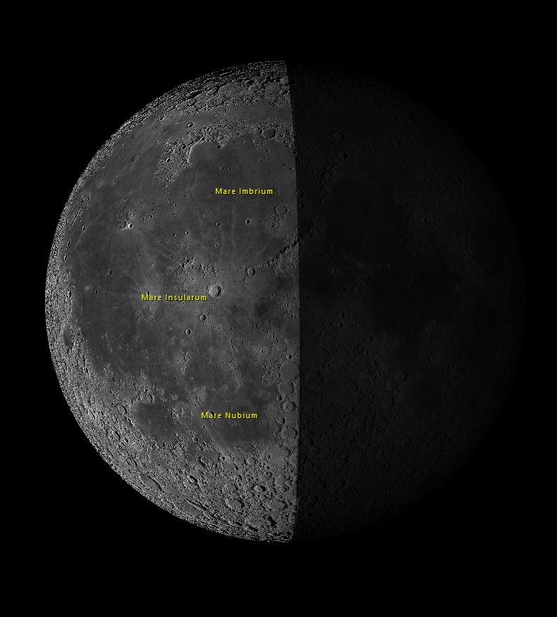
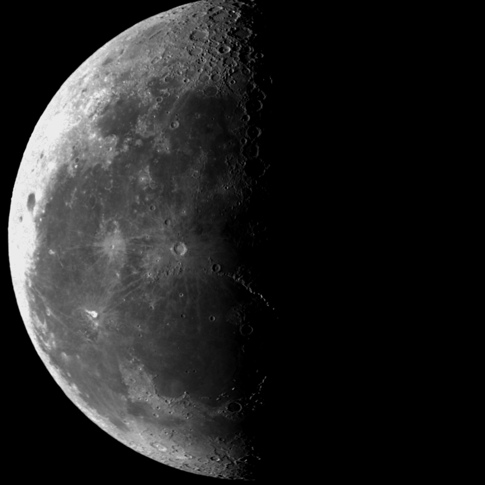
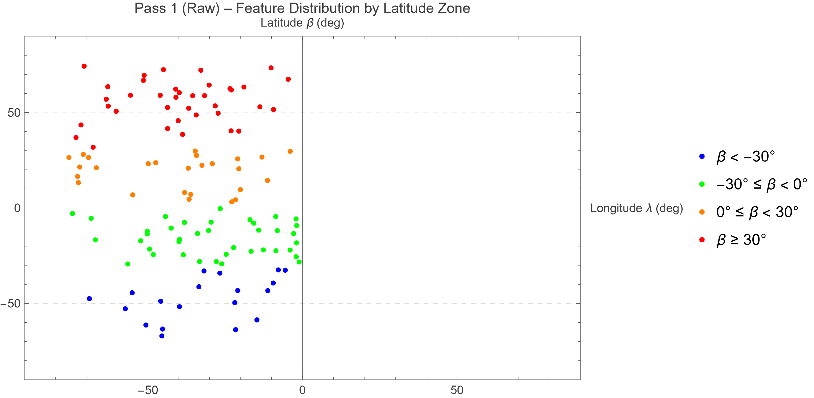
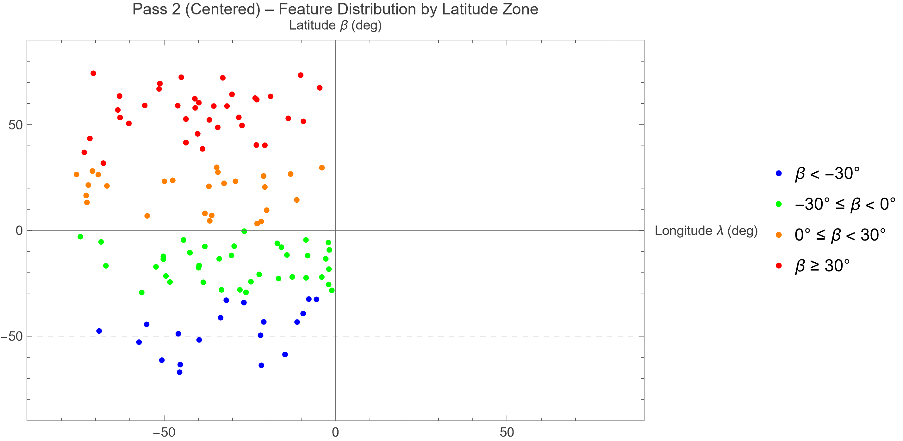
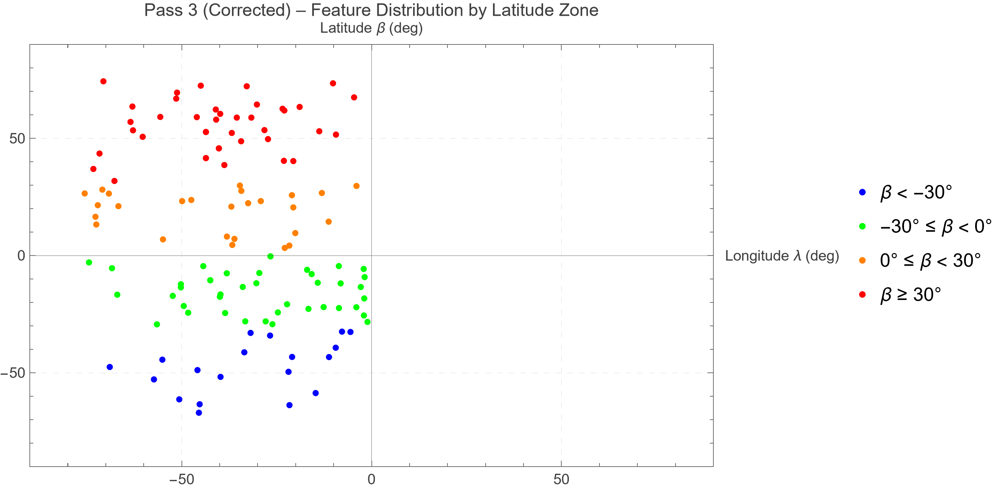
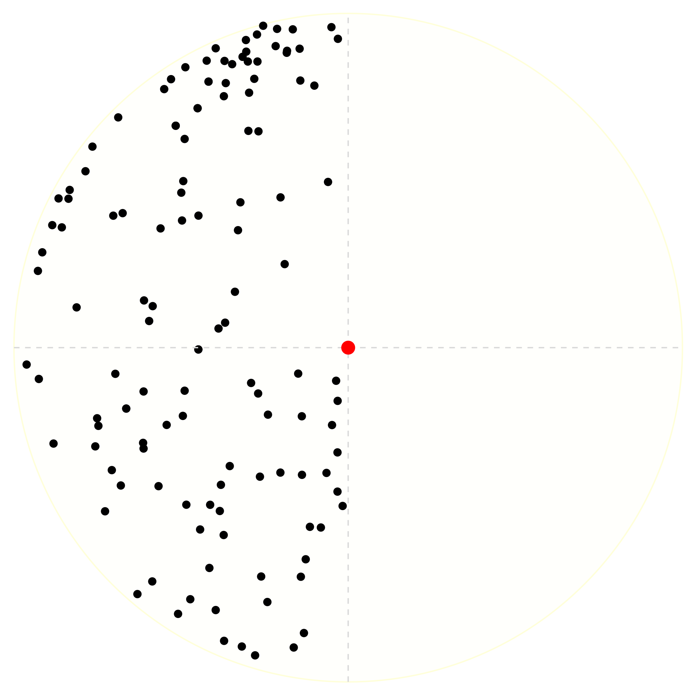

# Lunar Photogrammetry and Optical Libration

*Individual project · AE 451 · Izmir University of Economics · May 2026*

## Engineering question
What is the Moon's optical libration on a given night, determined from a single telescopic image?

## Approach
- 126 surface features measured in AstroImageJ on a FITS image (13 April 2023) and matched to Virtual Moon Atlas coordinates.
- Eight plate constants fitted by least squares (Kopal and Carder), with parallax corrections.

## Results
- Libration in longitude −3.182° and latitude +7.049°.

## Validation
Compared with the ephemeris: deviations of 0.48° and 0.45°.

## Figures
Figures are from the report and presentation (captions as in the report). The PDF originals are kept in `figures/` next to each PNG.

*Measurement workflow: a feature measured in pixel coordinates on the FITS image in AstroImageJ (left) and identified in the Virtual Moon Atlas at the same epoch to read its selenographic coordinates (right).*

*Report Figure 1(a): the rotated FITS image (13 April 2023, 03:10:47 UTC) used for pixel-coordinate measurements: North up, Mare Imbrium at upper left, terminator on the right.*

*Report Figure 1(b): the Virtual Moon Atlas view at the same epoch, with major maria labelled, used to read selenographic coordinates for each feature.*

*Report Figure 2: selenographic (λ, β) feature distribution for all three passes (raw, centred, corrected), colour-coded by latitude zone. West longitude is positive.*

*Report Figure 3: projected feature positions on the normalised lunar disc for all three passes: (a) raw pixel coordinates; (b) disc-centred coordinates; (c) parallax-corrected coordinates. Each dot represents one of the 126 measured features.*

Also in `figures/`:
- `…-residual-analysis`: plate-fit residuals
- `…-monthly-libration-series`: libration over the month
- `…-summary-table`: libration summary
- `…-ipynb.pdf`: the full notebook as a 38-page PDF

## Repository contents
- `notebooks/`: Wolfram Language Jupyter notebooks (outputs saved, so results display directly on GitHub)
- `report/`: written report (PDF)
- `figures/`: report and slide figures (PDF originals with PNG copies for display on GitHub)
- `data/DataFiles/2023-04-13/ScienceFrames/`: the lunar FITS science frame (13 April 2023) and derived images
- `data/DataFiles/2023-04-13/Measurements/`: measured feature coordinates (`.dat` and `.txt`: raw, centred, corrected), VMA ephemeris values, and the course reference measurement file
- The FITS files open in [AstroImageJ](https://www.astro.louisville.edu/software/astroimagej/) or [SAOImage DS9](https://sites.google.com/cfa.harvard.edu/saoimageds9); the `.dat`/`.txt` files are plain text.

## How to run
The notebooks use the Wolfram Language kernel for Jupyter (WolframLanguageForJupyter, Wolfram Engine or Mathematica 14).

The notebook imports the measurement files (.dat/.txt), which are now included in `data/DataFiles/2023-04-13/Measurements/`. To re-run, update the file paths in the notebook to point to this folder.

## Credits
This project was completed on a course notebook framework by **Prof. Fabrizio Pinto** (Izmir University of Economics), released under CC BY 4.0. The completed notebook, results and written report in this repository are my own work.

## License
CC BY 4.0, consistent with the original course material. Please credit both Prof. Fabrizio Pinto and Kaoutar Ammara.

Kaoutar Ammara · Aerospace Engineer · [GitHub](https://github.com/Kiwiiiieee) · [LinkedIn](https://linkedin.com/in/kaoutar-ammara)
